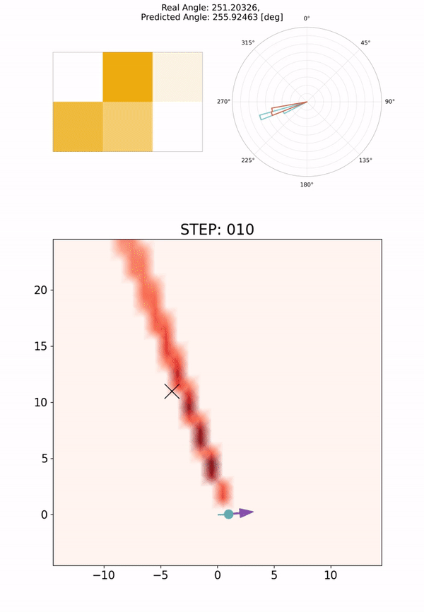

# Tetris-inspired detector with neural network for radiation mapping
In recent years, radiation mapping has attracted widespread research attention and increased public concerns on environmental monitoring. In terms of both materials and their configurations, radiation detectors have been developed to locate the directions and positions of the radiation sources. In this process, algorithm is essential in converting detector signals to radiation source information. However, due to the complex mechanisms of radiation-matter interaction and the current limitation of data collection, high-performance, low-cost radiation mapping is still challenging. Here we present a computational framework using Tetris-inspired detector pixels and machine learning for radiation mapping. Using inter-pixel padding to increase the contrast between pixels and neural network to analyze the detector readings, a detector with as few as four pixels can achieve high-resolution directional mapping. By further imposing Maximum a Posteriori (MAP) with a moving detector, further radiation position localization is achieved. Non-square, Tetris-shaped detector can further improve performance beyond the conventional grid-shaped detector. Our framework offers a new avenue for high quality radiation mapping with least number of detector pixels possible, and is anticipated to be capable to deploy for real-world radiation detection with moderate validation.   

[[Paper]](https://arxiv.org/abs/2302.07099)   


<p align="center">
  
</p>


# OpenMC setup
[1] Create conda environment for openmc simulations (Linux/Mac)
reference: https://docs.openmc.org/en/stable/quickinstall.html

```
$ conda create --name openmc-env python=3.9.9
$ conda activate openmc-env
$ conda install openmc -c conda-forge

```

You can also do the installation with the following commands:
```
$ conda create -n openmc-env openmc python==3.9.9
$ conda activate openmc-env  
```

   
other libraries (All of them can be installed in a short time. You can use cuda for pytorch model training)
```
scikit-learn==1.2.0
torch==1.11.0
tensorboardX==2.5
torchvision==0.12.0
protobuf==3.19.4
pyemd==0.5.1
imageio==2.19.2
scipy==1.11.4
numpy==1.26.2
matplotlib==3.8.2
```

[2] Download the OpenMC Library

```
$ wget -c https://anl.box.com/shared/static/d359skd2w6wrm86om2997a1bxgigc8pu.xz
$ tar -xf d359skd2w6wrm86om2997a1bxgigc8pu.xz
$ mv mcnp_endfb71/ openmc_library/ 
```

[3] Set the path of `crosssections.xml` file  
Assign the path to `crosssections.xml` by setting `env_config.py`.   
Make a copy of the `env_config_temprate.py` file and rename it to `env_config.py`. Modify the following environment variables in `env_config.py`.   
```  
os.environ['CUDA_VISIBLE_DEVICES']="path to the folder that contains this repo/radiation_mapping/openmc_library/cross_sections.xml" 
```  

You can also specify the path by adding the following line to .bashrc or .profile. 
```
export OPENMC_CROSS_SECTIONS="path to the folder that contains this repo/radiation_mapping/openmc_library/cross_sections.xml" 
```   


# Radiation mapping workflow

We use the folders below for storing files:   
**Training data**: ./save/openmc_data/      
**Filter layers**: ./save/openmc_data/      
**Models**: ./save/openmc_data/      
**Intermediate data for radiation mapping**: ./save/mapping_data/       
**Output for radiation mapping**: ./save/radiation_mapping/     

MAke sure to check the file/folder names for loading/saving outputs when you run each program. If you want to skip MC simulation or training model, you can use our data/models below. You can copy the file/folder from the folder `saved_files/` to the path shown above.   

Detector | MC data | MC filter | Model | Epochs | Note
----- | --- | --- | --- |--- |----- 
2x2 square | sq2_1_data/ | sq2_1_filter/ | sq2_1_model.pt | 200 | 1 source.
S-shape | s_1_data/ | s_1_filter/ | s_1_model.pt | 200 | 1 source.
J-shape | j_1_data/ | j_1_filter/ | j_1_model.pt | 200 | 1 source.
T-shape | t_1_data/ | t_1_filter/ | t_1_model.pt | 200 | 1 source.
10x10 square | sq10_2_data/ | sq10_1_filter/ | sq10_2_model.pt | 200 | 2 sources.
5x5 square | sq5_2_data/ | sq5_1_filter/ | sq5_2_model.pt | 200 | 2 sources.


## MC simulation to get training data
We generate the training data for our direction prediction. Using [OpenMC](https://docs.openmc.org/en/stable/) library, we simulate the radiation detector of square (or Tetris) configurations absorbing radiation from source(s) of random positions in specified dstances. You need to set the following parameters.   
**num_sources**: The number of radiation sources to place in the field.      
**a_num** (only for the square detector): The parameter for the configuration of the detector: a x a square shape.    
**shape_name** (only for the Tetris detector):  Tetris shape ['S', 'J', 'T', 'L', 'Z']    
**num_data**: The number of the generated data.   
**seg_angles**: The number of angle sectors ( augnlar resolution: 360 deg/seg_angles).   
**dist_min**: Minimum distance between the radiation source and the detector (cm).   
**dist_max**: Maximum distance between the radiation source and the detector (cm).   
**source_energies**: Photon energy of the radiation (eV).   
**num_particles**: The number of photon in MC simulation.   
**run_name**: The folder name to save the simulation results.    
```
$ python gen_data_tetris.py (or gen_data_square.py)
```

## MC simulation to get Filtering Layer
We generate the filterlayers for our direction prediction. Using OpenMC library, we simulate the radiation detector of Tetris (or square) configurations absorbing radiation from source(s). You need to set the following parameters.     
**a_num** (only for the square detector): The parameter for the configuration of the detector: a x a square shape.      
**shape_name** (only for the Tetris detector):  Tetris shape ['S', 'J', 'T', 'L', 'Z']   
**num_data**: The number of the generated data. Use the same number as 'seg_angles' in training data generation.    
**source_energies**: Photon energy of the radiation (eV).   
**num_particles**: The number of photon in MC simulation.   
**header_dist_particles_dict**: The profile of the distance and the number of photons for each set of filterlayers.     
**run_name**: The folder name to save the filterlayer files.    
```
$ python gen_filter_tetris.py (or gen_filter_square.py)
```

## Training
We train the U-Net architecture with filterlayers for predicting the directions of the radiation sources. We use the simulation data and filterlayers generated above. You need to set the following parameters.     
**num_sources**: The number of radiation sources to place in the field. Set the same value as the one you used for generating training data.    
**seg_angles**: The number of the generated data. Use the same number as 'seg_angles' in training data *generation.    
**epochs**: The total iterations to train the model.    
**data_name**: Training data folder name. Set it same as the folder name you used in gen_data_tetris.py (gen_data_square.py).    
**test_ratio**: The ratio of data used as the testing dataset.   
**k_fold**: The number setting for k-fold cross validation.   
**filter_name**: Filterlayer data folder name. Set it same as the folder name you used in gen_filter_tetris.py (gen_filter_square.py).      
**save_name**: The name for saving the model.     
```
$ python train_model.py
```

## Simulation with a moving detector
We generate an input files for radiation mapping. We consider the situation where the radiation source(s) is placed at the fixed position(s), and the detector move on the trajector to map the radiation.   
**input_shape**: (int) the size of the square detector (a_num),  or ['J', 'L', 'S', 'T', 'Z'] (string) for tetris detector (shape_name).     
**seg_angles**: The number of angle sectors (augnlar resolution: 360 deg/seg_angles). Make sure to use the same value as those of training data and filters.     
**model_name**: Model name trained with the code 'train_model.py'.     
**RSID**: The position of radiation source(s) in 2D space. The shape of the array is (n, 2), where n is the number of radiation sources.    
**rot_ratio** Rotation ratio \chi , where \phi = \chi * \theta      
**DT**: The digit of time (s).    
**SIM_TIME**: The total simulation time (s).     
**SIM_STEP** The simulation time step each of which we save pkl files.     
**num_particles**: The number of photon in MC simulation.     
**map_horiz**: The map geometry in the horizontal axis (m). (The bottom position, the top position, the number of pixels).    
**map_vert**: The map geometry in the vertical axis (m). (The left position, the right position, the number of pixels).    
```
$ python run_detector.py
```

## Mapping
The code produces the images of radiation mapping at each timestamp. After finishing processing the data of all time, it generata the image visualizing the mappping process.      
**fig_header**: The folder name header where run_detector.py saved pkl files.   
**th_level**: Threshold level of the map. We regard the map value zero at each pixel if the value after normalization is below this threshold level.    
**map_horiz**: The map geometry in the horizontal axis (m). (The bottom position, the top position, the number of pixels). Set the same values as 'run_detector.py'.   
**map_vert**: The map geometry in the vertical axis (m). (The left position, the right position, the number of pixels). Set the same values as 'run_detector.py'.    
```
$ python radiation_mapping.py  
```


## Citation of this work
```
@article{okabe2023tetris,
  title={Tetris-inspired detector with neural network for radiation mapping},
  author={Okabe, Ryotaro and Xue, Shangjie and Yu, Jiankai and Liu, Tongtong and Forget, Benoit and Jegelka, Stefanie and Kohse, Gordon and Hu, Lin-wen and Li, Mingda},
  journal={arXiv preprint arXiv:2302.07099},
  year={2023}
}
```