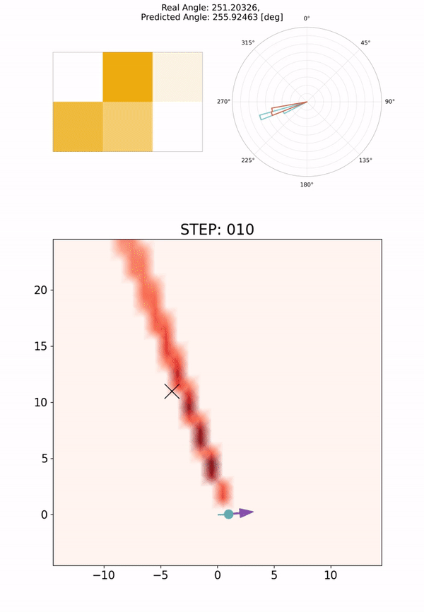

# Tetris-inspired detector with neural network for radiation mapping

<!-- <p align="center">
   
</p> -->

<p align="center">
  
</p>


# Starting OpenMC

reference: https://docs.openmc.org/en/stable/quickinstall.html

[1] Create conda environment for openmc simulations
```
$ conda create -n openmc-env openmc python==3.9.9
$ conda activate openmc-env  
```

.. or create from the exported env
```
$ conda env create -f openmc-train.yml
```
[2] Download the OpenMC Library

```
$ wget -c https://anl.box.com/shared/static/d359skd2w6wrm86om2997a1bxgigc8pu.xz
$ tar -xf d359skd2w6wrm86om2997a1bxgigc8pu.xz
$ mv mcnp_endfb71/ openmc_library/ 
```

[3] Set the path of crosssections.xml file  
In .bashrc or .profile, add the line shown below:  
```
OPENMC_CROSS_SECTIONS="/The directory where the source code is located/radiation_mapping/openmc_library/cross_sections.xml" 
```   
(temporary) You can assign the path to crosssections.xml by setting env_config.py. You can duplicate the file env_config_template.py, rename it to env_config.py, and assign the path to OPENMC_CROSS_SECTIONS. 

<!-- # Other env setting (If you use Drake for MAP analysis)
You need to set up another conda env to run mapping_*.py program
```
$ conda env create -f radmap.yml
``` -->

# radiation_mapping (2D)

If you want to skip MC simulation or training model, you can use the archive data/models below.   

Detector | MC data | MC filter | Model | Epochs | Note
----- | --- | --- | --- |--- |----- 
2x2 square | save/openmc_data/sq2_1_data/ | save/openmc_filter/sq2_1_filter/ | save/models/sq2_1_model.pt | 200 | 1 source.
S-shape | save/openmc_data/s_1_data/ | save/openmc_filter/s_1_filter/ | save/models/s_1_model.pt | 200 | 1 source.
J-shape | save/openmc_data/j_1_data/ | save/openmc_filter/j_1_filter/ | save/models/j_1_model.pt | 200 | 1 source.
T-shape | save/openmc_data/t_1_data/ | save/openmc_filter/t_1_filter/ | save/models/t_1_model.pt | 200 | 1 source.
10x10 square | save/openmc_data/sq10_2_data/ | save/openmc_filter/sq10_1_filter/ | save/models/sq10_2_model.pt | 200 | 2 sources.
5x5 square | save/openmc_data/sq5_2_data/ | save/openmc_filter/sq5_1_filter/ | save/models/sq5_2_model.pt | 200 | 2 sources.


## MC simulation to get training data (env=openmc-train)
```
$ gen_data_tetris.py (or gen_data_square.py)
```

## MC simulation to get Filtering Layer (env=openmc-train)
```
$ gen_filter_tetris.py (or gen_filter_square.py)
```

## Training (env=openmc-train)
```
$ train_model.py
```

## Simulation with a moving detector (env=openmc-train)
```
$ run_detector.py
```

## Mapping (env=radmap)
<!-- ```
# If you use Drake  
$ radiation_mapping_drake.py  
  
# Else   -->
If you come across 'NaN' in the output maps, please adjust the value 'factor1' in utils/mapping.py.
```
$ radiation_mapping.py  
```

